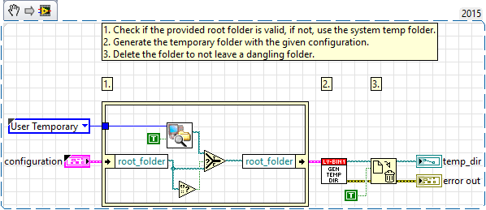

# lv-bin

A collection of labview utilities which reference self-contained binaries and/or commands available in Windows. Directly, it doesn't do a whole lot, but enables basic functionality in other lv-bin packages.

## Description

lv-bin implements a kind of internal versioning by namespacing major versions of the api with a library (e.g. v1.lvlib). This should allow any future changes that would break the api, to be placed inside another library (appropriately namespaced) and maintain previous major version apis.

The high-level goal for lv-bin is to provide one or more utilities that can be used in other lv-lib libraries.

* api v1 (v1.lvlib)
  * add_data_path.vi: this vi can be used to add a path to a functional global that can be used to try and find the absolute path of the executable. Some implementations work easier if you can provide the absolute path rather than a relative path to execute a command. This is a polymorphic vi that will allow you to add a scalar or array path.
  * generate_temp_directory.vi: this vi can be used to generate and create a temporary folder (it's a NRE vi), the configuration allows you to provide a prefix (appended to the numbers) and a root folder where the temp folder is generated. If no root path is provided (e.g it's empty) it'll use the system temp folder.
  * get_system_paths.vi: this vi can be used to get the system paths to add them to (add_data_path.vi) to maintain the use case for being able to use the absolute path or realtive path of your executable.
  * read_data_paths.vi: this vi allows you to get an array of all the data paths added using the add_data_path.vi
  * search_relative_path.vi: this vi was a hold-over from a use case where this was a plugin architecture rather than classes that would be compiled together, this vi will walk up from a given directory to attempt to find a given file or folder provided and tell you if the file exists.

## Example 01 - Setup Path

## Example 02 - Generate Temp Directory

